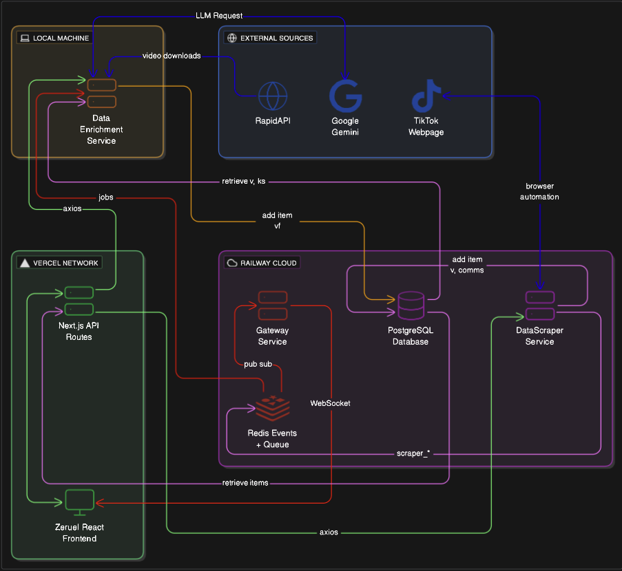
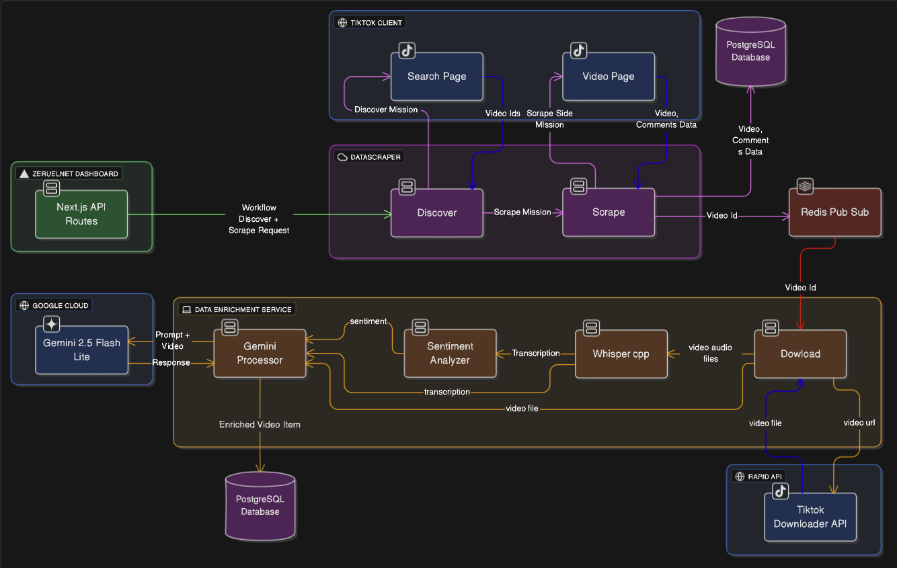

# Zeruel Net

ZeruelNet is an intelligence platform for scraping and analyzing geopolitical sentiment and propaganda on Tiktok.

🚀 **[Live Dashboard](https://zeruel-net-zeruel-dashboard.vercel.app)**

## Key Features

- **Political Alignment Analysis** - Automatically scores content for political positioning (1 Pro West / 0 Neutral / -1 Pro Kremlin)
- **AI-Powered Content Processing** - Whisper transcription, sentiment analysis, and LLM based subject identification and summarization
- **Web Scraping** - Identify new videos by scraping the discover page, and comment sections of video pages ( limited to 4 pages in parallel because of platform rate limits)
- **Advanced Analytics** - Correlation insights between engagement metrics and political alignment

## Architecture Overview

ZeruelNet is hosted on Railway and Vercel with a microservices design. The system uses event-based messaging through Redis Pub/Sub messaging to coordinate between services, with a Gateway Service that routes real-time updates to multiple ZeruelDashboard clients via WebSockets.

- **DataScraper Service** (Railway) - Playwright-based TikTok scraping
- **Gateway Service** (Railway) - WebSocket hub for real-time communication across services 
- **DataEnrichment Service** (Local) - AI enrichment pipeline with Whisper.cpp, sentiment analysis, and Gemini LLM for extrecting subjects and political positioning
- **ZeruelDashboard** (Vercel) - React/Next.js analytics dashboard with live updates
- **Redis & PostgreSQL** (Railway) - Message broker and data persistence layer

## Data Processing Workflow

ZeruelNet transforms scraped TikTok content into political insights through a multi-stage pipeline:

**Process Flow:**
1. **Discovery** - Search TikTok pages for content (hashtags, search, user)
2. **Scraping** - Extract video metadata and comments
3. **Queue Processing** - Videos are queued for the AI enrichment pipeline via Redis message broker
4. **AI Enrichment** - Download videos, extract transcripts (Whisper.cpp), analyze sentiment, and process with Gemini LLM
5. **Storage** - Scraped Data and Enriched Data are stored in PostgreSQL

## Tech Stack

1. **Zeruel Dashboard:** React, Next.js, TypeScript, Tailwind CSS, Zustand.
2. **Data Scraper Service:** Playwright, Node.js, Express, Typescript.
3. **Data Enrichment Service:** Whisper cpp, Gemini, Sentiment Analysis, Python, Numpy.
4. **Gateway Service:** Websocket, Node.js, Express, Typescript.
5. **Infrastructure:** Redis, PostgreSQL, Playwright.  
